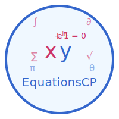

<div align="left">
  
</div>

# EquationsCP
A FastMCP server for solving algebraic equations using SymPy.

## Features

- Solve linear equations algebraically
- Get step-by-step solutions
- Easy integration with Claude Desktop and other MCP clients

## Installation

This project uses pipenv for dependency management. The required dependencies are:

- sympy
- fastmcp
- npx(for running the MCP Inspector)

These dependencies are already specified in the Pipfile at the root of the project with the exception of `npx`.

## Usage

Compiled binaries for Linux(`amd64` and `arm64`) and macOS(`arm64`) can be found [here](https://github.com/EquationsCP/equationscp/releases). Download the appropriate binary for your platform, and run: `./<FILENAME>`.

> [!NOTE]
> Windows binaries will be released fairly soon.


> [!WARNING]
> Note that macOS may throw an error when you try running the binary since these binaries are unsigned. To get around that, open `System Settings` > `Privacy & Security`. Scroll down and you'll see the `equationscp` binary being flagged with an option to allow the executable to run anyway. Click that, and you may be asked to authenticate with your root password / TouchID. 

Congratulations! The MCP server is now running. It runs listening for MCP requests over `stdio` by default, but this will be made more flexible to accomodate streamable HTTP or SSE in the future. You can now configure Claude Desktop using the instructions documented here: [https://modelcontextprotocol.io/quickstart/server#testing-your-server-with-claude-for-desktop](https://modelcontextprotocol.io/quickstart/server#testing-your-server-with-claude-for-desktop). Here's what a sample `claude_desktop_config.json` would look like:

```json
{
    "mcpServers": {
        "equationscp": {
            "command": "/Users/rudimk/Downloads/equationscp-v0.1.0-rc-2505150621-darwin-arm64",
            "args": []
        }
    }
}
```

Restart Claude Desktop, and you should now be able to use the MCP server. Here's what it looks like in action:


 _Claude asking for permission to call EquationsCP_

 _The equation being converted to an input for the MCP server_

 _The MCP server's output along with how Claude finally renders the solution_


## Development

### Starting the Server

To start the server, run:

```bash
pipenv run stdio-server
```

Or alternatively:

```bash
fastmcp run src/server.py
```

This will start the MCP server and listen for calls over `stdio`.

To run the app in HTTP mode(with SSE):

```bash
pipenv run http-server
```

Or alternatively:

```bash
fastmcp run src/server.py --transport sse --host 0.0.0.0 --port 4242
```

The server will start on `http://0.0.0.0:4242`. 

### Using with Claude Desktop

TBD, since I refuse to spend $100 every month on a Claude Max plan _just_ to test support for adding HTTP-based MCP servers. We'll wait for our friends to Anthropic to release this in GA.

### Testing the Server

If you have `npx` available, you can use the MCP Inspector:

```bash
pipenv run inspector
```

Alternatively:

```bash
npx @modelcontextprotocol/inspector fastmcp run src/server.py
```

This will allow you to access the MCP Inspector at `http://127.0.0.1:6274`, where you can list available tools, and run sample calls against them.

### Using the Equation Solver Tool

The server exposes a tool called `solve_linear_equation` that can be used to solve linear equations.

#### Input Format

```json
{
  "equation": "2*x + 3 = 7",
  "variable": "x"
}
```

#### Output Format

```json
{
  "solution": {
    "variable": "x",
    "value": 2.0
  },
  "steps": [
    "Original equation: 2*x + 3 = 7",
    "Equation in symbolic form: 2*x + 3 = 7",
    "Subtract 3 from both sides: 2*x = 4",
    "Divide both sides by 2: x = 2.0",
    "Solution: x = 2.0"
  ]
}
```

## Examples

### Example 1: Simple Linear Equation

Input:
```json
{
  "equation": "2*x + 3 = 7",
  "variable": "x"
}
```

Output:
```json
{
  "solution": {
    "variable": "x",
    "value": 2.0
  },
  "steps": [
    "Original equation: 2*x + 3 = 7",
    "Equation in symbolic form: 2*x + 3 = 7",
    "Subtract 3 from both sides: 2*x = 4",
    "Divide both sides by 2: x = 2.0",
    "Solution: x = 2.0"
  ]
}
```

### Example 2: Linear Equation with Negative Coefficient

Input:
```json
{
  "equation": "-3*y + 5 = 8",
  "variable": "y"
}
```

Output:
```json
{
  "solution": {
    "variable": "y",
    "value": -1.0
  },
  "steps": [
    "Original equation: -3*y + 5 = 8",
    "Equation in symbolic form: -3*y + 5 = 8",
    "Subtract 5 from both sides: -3*y = 3",
    "Divide both sides by -3: y = -1.0",
    "Solution: y = -1.0"
  ]
}
```

## Future Enhancements

- Support for quadratic equations
- Support for systems of linear equations
- Support for symbolic solutions (with parameters)
- Support for differential equations
- Support for a lot more(differential and integral calculus, combinatorics, discrete math, matrix and linear algebra among others)
